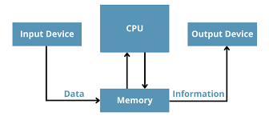
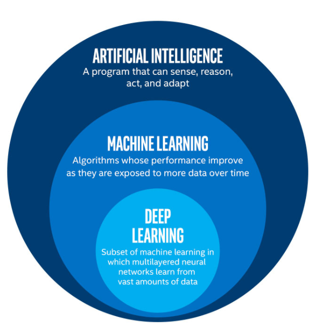
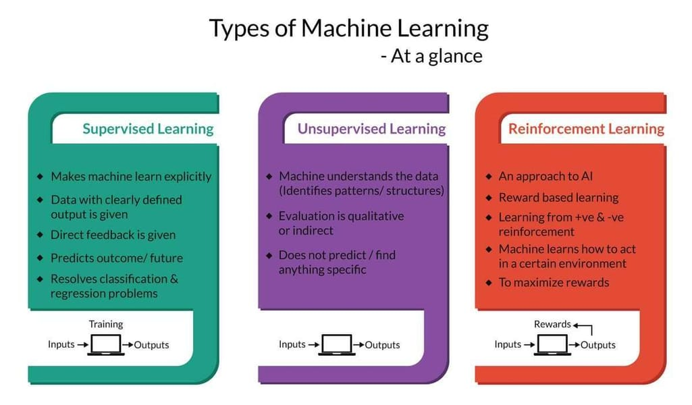

### Machine Learning Day 01

# What can a computer do?

# Mojo is a language that newly use in machine learning sector, and it is a combination of Phython and Java.

- Artificail intelligence generally false under two broad categories. 
1. Narrow Artificial Intelligence(Week Inter^2)
    - It focus on performing specific tasks
    - Ex: ChatGPT, Amozon Alexa, Youtube Recommendation, Self Driving Car
2. Artificial General Intelligence
    - Human brain level Intelligence

## Main Part of AI
1. Computer Vision( Identifying things with Vision)
2. Machine Learning( Learning)
3. Natural Language Processing( Communication with Language)

## Machine Learning
- Machine Learning (ML) is a type of artificial intelligence(AI) that allows software application to become more accurate at preding outcomes without being explicitly programmed to do so.

## Sub part of Machine Learning

## Deep Learning
- In Deep Learning, an artificial neuron is created which will follow the functions of the biological neurons
## Natural Language Processing
- NLP is a subfield of AI
- It helps machines process and understand the language, so that they can automatically perform repetitive tasks. 
## Image Processing
- Image processing is a method to perform operations on an image to extract information from it or enhance it. 
- Digital image processing has a broad range of applications such ad image restaration, medical image, remote sensing and image segmentation

