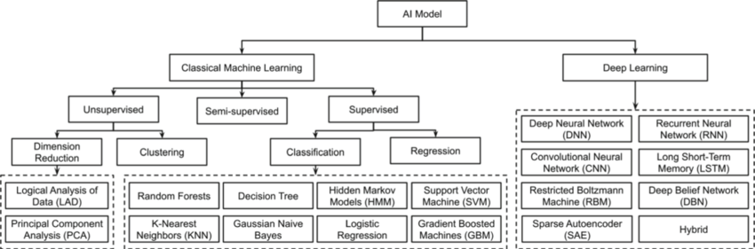
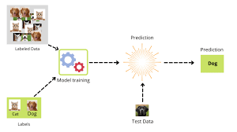
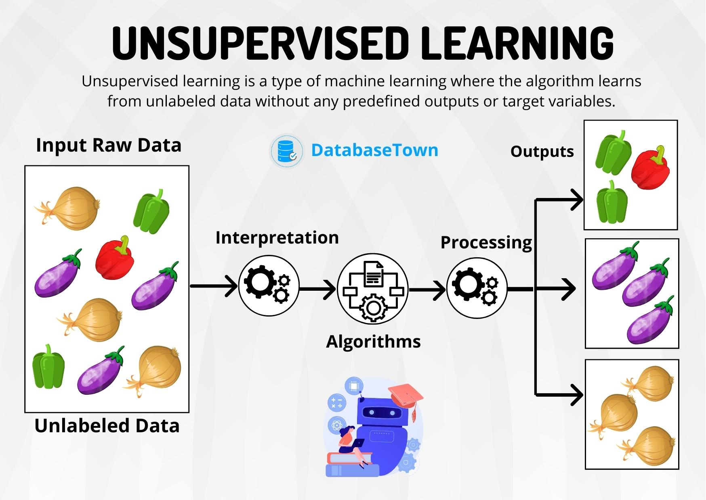

### Machine Learning
- Here we can it devide into 2 category, 
1. Classical Machine Learning
    - Only depend on a mathematical functions
2. Deep Learning
    - Build the system that almost similar to the human brain

## Supervised Learning
- What is supervise? Guide to do some task like steps of process
- Basically we teach each part to model if this gives this kind of input the output should be this. "
- In supervised learning, we can predict the output that not include the data set of the input.

# Overtraing / Overfitting
- Overtraing refers to a model that training data too well. This means that the noise or random fluctuations in the training data is picked up and learned as concepts by the model. 
- The problem is that these concept do not apply to new data and negativly impact the models ability to generalize. 
# Undertraing / Undertraining
- Undertraining refers to a model that can neither model the traing data not generalize to new data. An underfit machine learning model is not a suitable model and will be obvious as it will have poor performance on the training

## Unsupervised Learning
- Unsupervised Learning is where you only input data (x) and no corresponding output variables. Derive some structure or pattern from the "Unlabeled Data" by just looking at the relationship between data themselves. There are few methods to check the accuracy of these models.

## Reinforcement Learning
- It is about suitable action to miximize rewards in particular situation. It is employed by various software and machines to find the best behaviour or path it should take in a specific situation. 
- Reinforcement Learning differs from the supervised learning in a way that in supervied learning the training data has the answer key with it. So the model is trained with the correct answer itself. 
- Wheres in rainforcement learning, there is no answer but the rainforcement agent decides what to do to perform the given task. 
