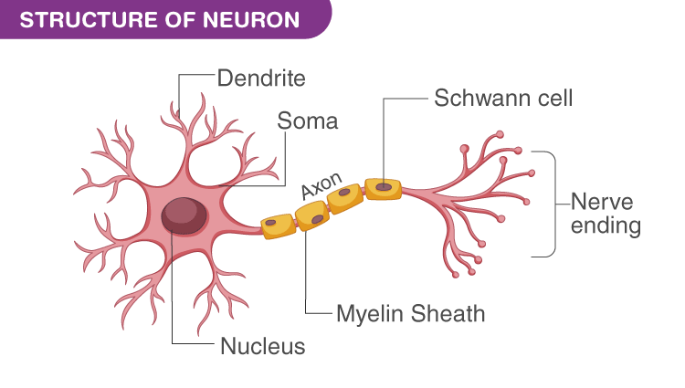

### Day 03
## Deep Learning
- Brain inspired systems are intended to replicate the way, that we human learn. 
- Consistance of input and output layers, as well as (in most cases) a hidden layer consisting of units that transform the input into something that the output layer can use.
- When a child is born, what does the child know? To out knowledge, the child knows only how to cry. 
- The child probabily does not know its parents. When the child grows, the step by step learning process begins first, the child learns to drink milk. Then child learns to identify to identify its parents. Every time a child learns something it is encoded into some portion of the brain. If we do not practice what we learned, we start to forget consequently, by practice or training, we can hard code some selected things into our brain. 
- Futhermore, Neuroscienctists belive, that learning simulates new deadrite connections between neurons. Greater usage of the brain through learning and simulation create greater dendlite connectivity thus, as we learn more and morem we become more intelligent. Based on how we learn and how we practice what we learn.

## Biological Neuron Vs Artificial Neurons

## Linear Algebra
# Metrix
- Vector, Row Vector and Scalar

- Vector: If the columb count is 1, then that is vector.
- Row Vector: If the row count is 1, then that is row vector.
- Null metrix, Diogonal matrix, Identity matrix

# Deteminant of matrix

