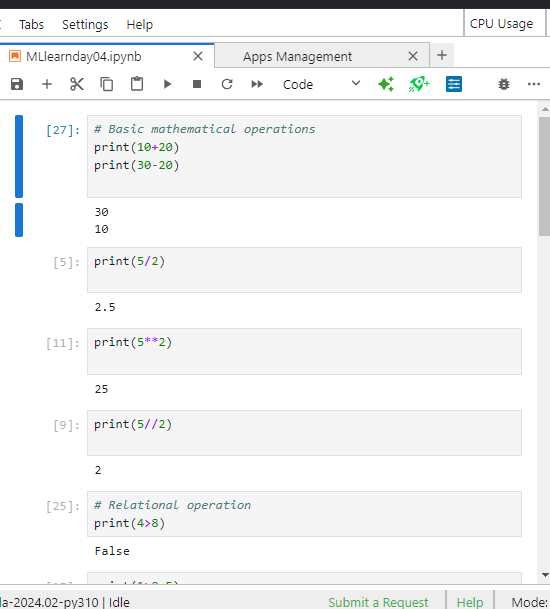
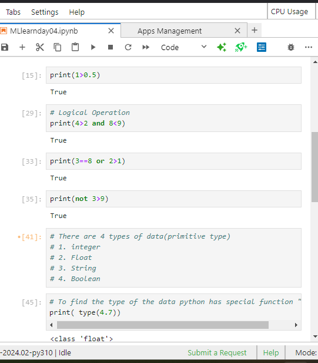
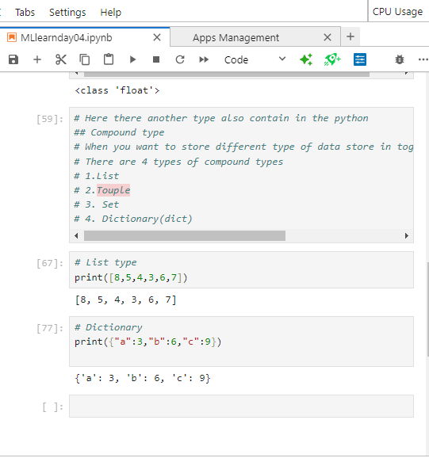

# Learning Python
- Here I use jupitor notebook to learn the python

- Here day04 file include python file

# Special notes

- There are 4 types of data(primitive type)
 1. integer
 2. Float
 3. String
 4. Boolean
- To find the type of the data python has special function "type".
    - print( type(4.7))
- Here there another type also contain in the python- Compound type
- When you want to store different type of data store in together, that morment use this type.
- There are 4 types of compound types
1. List
2. Touple
3. Set
4. Dictionary(dict)
- List type
    - print([8,5,4,3,6,7])
- Dictionary
    - print({"a":3,"b":6,"c":9})
