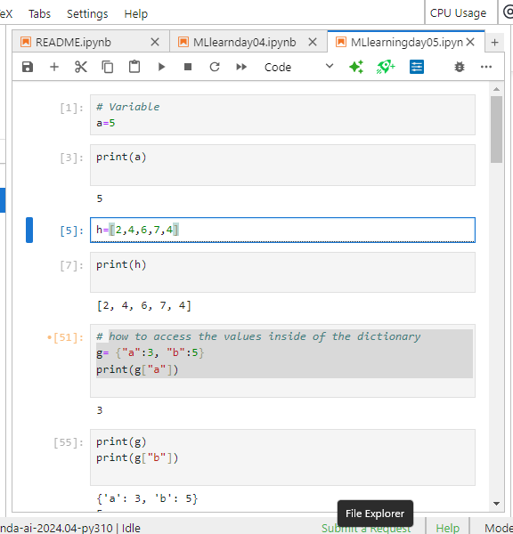
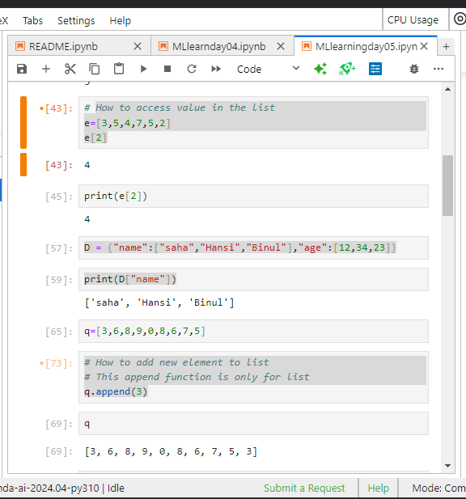
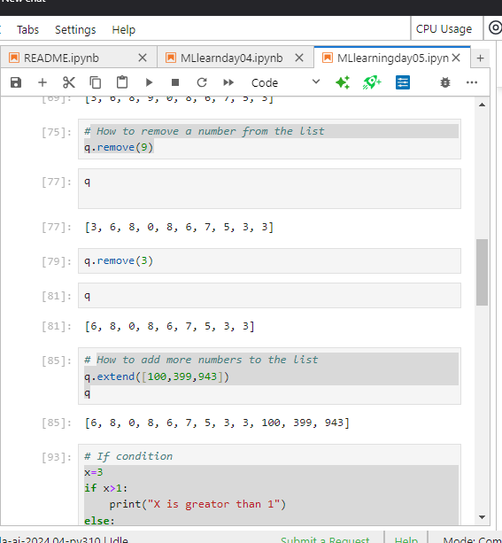
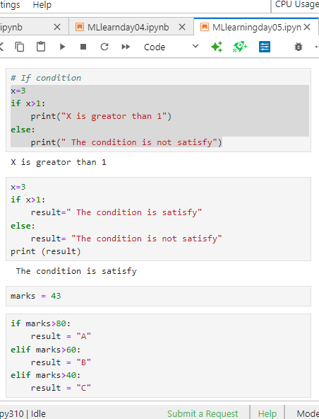
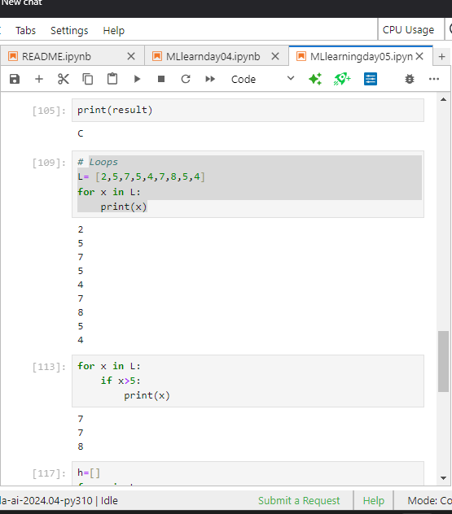

## Python Fundermental

- Variables
- how to access the values inside of the dictionary
    - g= {"a":3, "b":5}
    - print(g["a"])
- How to access value in the list
    - e=[3,5,4,7,5,2]
    - e[2]
- How to add list inside of the dictionary
    - D = {"name":["saha","Hansi","Binul"],"age":[12,34,23]}
    - how it access it 
        - print(D["name"])

- How to add new element to list
- This append function is only for list
    - q.append(3)

- How to remove a number from the list
    - q.remove(9)
- How to add more numbers to the list
    - q.extend([100,399,943])
    - q
- If condition
    - if x>1:
- Loops 
    - for x in L:
  

