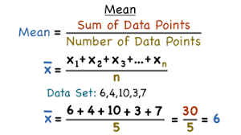
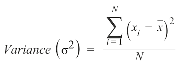
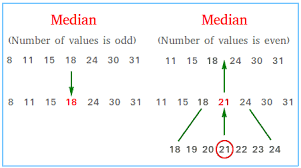
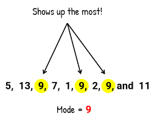
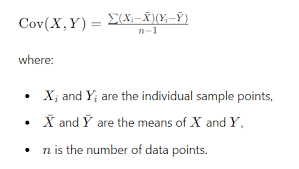
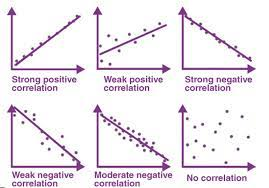
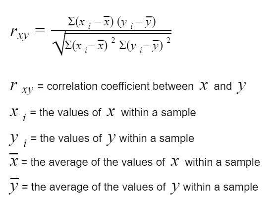

### Statistical Summery of AI
## Mean of the Data
- Mean is also know as average of all the number in the data set which is calculated by below equation. 

## Variance of Data
- Variance is the numerical values that describe the variable of the observations from its arithmatics mean. Standard deviation is the square root of the variable.

- This is the equation that consider the sampling one as in deference equation.

## Median of the Data Set
- Median is the mid value in this ordered data set.

## Five number summery of data

## Mode of the data 
- The mode is the value that has highest number of occurances in a set of data. Unlike mean and meduian, mode can have both numeric and chatacter data. 

## Covariance of two numerical variables
- Covariance will measure joint variation of two numerical variables. This is a measure of the relationship between two variables.

- This variable may be have (-)infinity to (+) infinity. That means, is may be has - value, + value or 0.

- In this covariance, if it is positive or negative, if the number value when icrease, the strongest of the graph also increasing. 

## Correlation of two numerical variables
- Correlation is also a measurement of the relationship between two numerical variables. It is lying between -1 to +1. 

