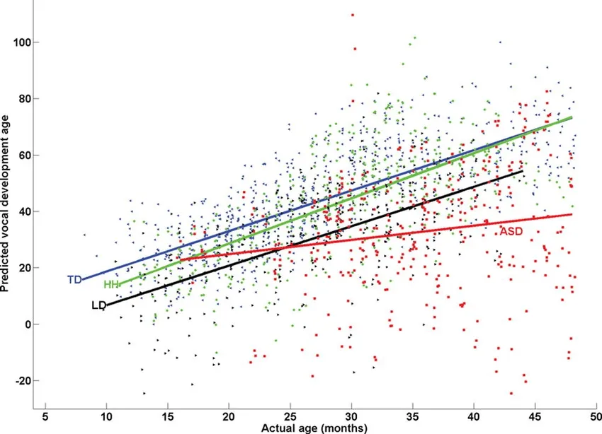
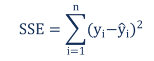

### Machine Learning Algorithm

## Linear Regression.

- Linear regression is perhaps one of the most well known and well understood algorithms in statistics and machine learning. 
- Linear regression is a linear model, eg: a model that assumes a linear relationship between the input veriable (x) and the single output variable (y). 
- More specially, that y can be calculated from a linear combination of the input variable(x).
- When there is a single input variable(x), the method is referred to as Simple Linear Regression. When there are multiple input variables, literature from statistics often refers to the method as Multiple Linear Regression.
- Different techniques can be used to prepare or train the linear regrassion equation from data, the most common of which is called Oridinary Leasy Squares. 
- It is common to therefore refer to a model prepared this way as Ordinary Least Squares Linear Regression or just Least Squares Regression.

## Simple Linear Regression

- simple linear regression is useful for finding relationship between two variable. One is predictor or independent variable and other is response or dependent variable which is a quatitative variable. 
- For example, relationship between height and weight.
- When we discuss the relationship between the same kind of a relation, there are Different kind of relations may be found. 
- But the thing is we need to find the best path or equation for stasfy the condition or senario. 

- From these need to find the most preffered relation. 
-  But even this morment also we can get the 100% correct relation. So need to find the relation that happen the minimum error.  That is the goal.

## Finding Solution for this. 

- The equation for this model for the population is as follow,

- The values β0 and β1 must be chosen so that they minimize the error. 
- If sum of squared error is taken as a metric to evaluate the model, then goal to obtain a line that best estimated mode which reduces the error.

- This is called as Residual Sum of Squares(RSS) as well. By minimizing this SSE, we can obtain following parameter estimations. 
- Signigiciance of these parameters can aslo be measures using Hypothesis Testing.

## Multiple Linear Regression
- The equation for this model is as follows, 

- Consider here we have a k variable. By minimizing this SSE, we can obtain the parameter estimations in here as well. 
- These estimated parameters can be represented as a vector. 
- When the model has 2 variable, 

